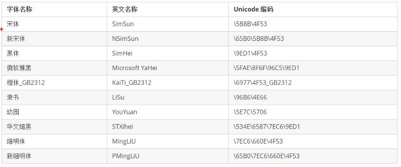

## CSS简单笔记

1. 例子

   ```css
   h2 {
       font-style: italic;
       font-weight: bold;
       font-size: 14px;
       font-family: "Microsoft YaHei",tahoma,"\5B8B\4F53";
       color: pink;
   }
   ```

   

2. **font-style**，字体样式，`normal或italic`

3. **font-weight**，字体粗细

   > 值有lighter、normal、bold、bolder、100~900（100的整数倍）
   >
   > normal相当于400，bold相当于700

4. **font-size**，字体大小，如`font-size: 30px`

5. **font-family**，字体中英文和Unicode码对照表

   

6. **font**，综合设置字体样式

   > font: font-style  font-weight  font-size/line-height  font-family;
   >
   > 须按以上顺序书写，以空格隔开
   >
   > font-size和font-family不能省略

7. 类的命名规范

   * 用横杠`-`，不要用下划线`_`
   * 不能以数字开头
   * 多个类名用空格隔开，`class="c1 c2"`
   * 样式显示效果与HTML元素中类名先后顺序无关，与CSS样式书写的上下顺序有关

8. 类选择器与Id选择器的区别

   * 类选择器可以重复使用
   * ID选择器只能一个元素使用

9. `*`星号，通配符选择器，代表所有选择器；但用的少。

   ```css
   * {
       color: red;
   }
   ```

   

10. `:`伪类选择器 - 链接伪类选择器

    - **:link**，未访问的链接

    - **:visited**，已访问的链接

    - **:hover**，鼠标移动到链接上

    - **:active**，选定的链接，点击鼠标不松开时

    - 注意书写顺序，须按lvha顺序书写

      ```html
      <style>
          a:link {
              color:blue;
          }
          a:visited {}
          a:hover {}
          a:active {}
      </style>
      <div>
          <a href="#" >秒杀</a>
      </div>
      ```

      

11. 伪类选择器 - 结构（位置）伪类选择器（指定选择器）

    * **first-child**，选取属于其父元素的首个子元素

    * **last-child**，选取属于其父元素的最后一个子元素

    * **nth-child(X)**，匹配属于其父元素的第X个子元素，`nth-child(even)`：匹配所有偶数，odd-奇数

    * **nth-last-child(X)**，倒数

      ```html
      <style>
          li:first-child {
              color:red;
          }
          li:nth-child(2n) { /*第2、4、6个孩子变蓝色*/
              color:blue;
          }
      </style>
      <ul>
          <li>第1个孩子</li>
          <li>第2个孩子</li>
          <li>第3个孩子</li>
          <li>第4个孩子</li>
          <li>第5个孩子</li>
          <li>第6个孩子</li>
          <li>第7个孩子</li>
      </ul>
      ```

      

12. 伪类选择器 - 目标伪类选择器

    * **:target**，用于选取当前活动的目标元素

      ```html
      <style>
          :target {
              color:red;
              font-size:30px;
          }
      </style>
      <div>
          <a href="#two" >跳到第二段</a>
          <h4 id="one">第一段</h4>
          <h4 id="two">第二段</h4>
          <!--通过a链接跳到第二段，第二段会变成“:target”指定的样式-->
      </div>
      ```

      

13. CSS外观属性

    * **color**
      1. `color: red;`
      2. `color: #FF00FF00;`
      3. `color: rgb(203,23,223);`
      4. `color: rgba(0,0,0,0.5);`，a的取值范围0~1
    * **text-align**，水平对齐方式
      * `text-align: center`;
      * 值有left、center、right等
    * **line-height**，行距
      * `line-height: 22px;`
      * 一般行距比字号大7~8像素即可
    * **text-indent**，首行缩进
      * `text-indent: 2em`
      * 1em就是一个字的宽度
    * **letter-spacing**，字（字母）间距
      * `letter-spacing: 2px`
      * 允许负值，默认normal
    * **word-spacing**，单词间距
      * `word-spacing: 10px;`
      * 对中文无效
    * **text-shadow**，文字阴影
      * `text-shadow: 5px 11px 3px rgba(0,0,0,0.5) `
      * `text-shadow: 水平位置(必填) 垂直位置(必填) 模糊距离(选填) 阴影颜色(选填)`
      * 英文：`text-shadow: h-shadow v-shadow blur color`

14. sublime快捷键，xxx+tab

    * `div*10`，10个div
    * `ul>li*5`，ul下面5个li
    * `div+p+div`，兄弟关系，依次创建div，p，div
    * `.first-class`，即`<div class="firsti-class"></div>`
    * `#firstid`，即`<div id="firstid"></div>`
    * `p.first-class`，即`<p class="first-class"></p>`

15. 三种样式表

    1. 行内样式表

    2. 内部（内嵌）样式表

    3. 外部样式表 

       `<link ref="stylesheet" href="style.css" type="text/css" />`

16. 行内（内联）元素特点

    1. 和相邻行内元素在一行上
    2. 高、宽无效，但水平方向的padding和margin可以设置，垂直方向的无效
    3. 默认宽度就是本身内容的宽度
    4. 行内元素只能容纳文本或其他行内元素。（a特殊）
    5. 另外：
       * p、h1~h6、dt都是文本块级元素，里面不能放块级元素
       * a元素里面不能再放a

17. 块级元素特点

    1. 总是从新行开始
    2. 高度、宽度、内边距、外边距都可以控制
    3. 宽度默认是100%
    4. 可以容纳内联和块级元素

18. 行内块元素（inline-block）

    * 有：img，input，td；可以设置宽高和对齐属性

    * 特点：高度，宽度，外内边距都可以控制

19. 行内与块级别互相转换

    > display: block; 转为块级元素
    >
    > display: inline; 转为行内元素
    >
    > display: inline-block; 转为行内块元素

20. 复合选择器

    * 交集选择器`div.c1`

    * 并集选择器`div,p`，用逗号隔开，书写规范为每个逗号占一行

    * 后代选择器`div p`，用空格隔开

    * 子元素选择器`ul>li`，用大于号；也叫儿子选择器，不包括孙子

    * 属性选择器 `a[name]`，用中括号；

      * `a[name]`，表示选择设置了name属性的所有a标签

      * `input[type=text]`，表示所有`type="text"`的input标签

      * `div[class^=font]`，表示class名以font开始的div；

        ```html
        <style>
            div[class^=font] { /*类名为font1、font2、font3的颜色改为blue*/
                color:blue;
            }
        </style>
        <div class="font1">选择器1 </div>
        <div class="font3">选择器12 </div>
        <div class="font2">选择器13 </div>
        <div class="abd">选择器1 </div>
        ```

      * `div[class$=font]`，以font的结尾

      * div[class*=font]，任意位置有font即可

    * 伪元素选择器`E::first-letter`

      * **E::first-letter**，文本的第一个单词或字

      * **E::first-line**，文本第一行

      * **E::selection**，可改变选中文本的样式

        ```css
        p::selection {
        	color: pink;
        }
        ```

      * **E::before**，在元素内部的前面插入content，

        ```css
        div::before {
            content: "俺";
        }
        ```

      * **E::after**，在元素内部的后面插入

21. CSS书写规范

    1. 并集选择器换行显示，如：

       ```css
       p,
       div,
       .user {
           color：red;
       }
       ```

    2. 选择器的嵌套层级不要超过3级

    3. 属性以分号结尾

22. **背景**

    ```css
    div {
    	background-color: #f00;/*带透明度的写法：rgba(255,0,0,0.5),错误写法：#5f00*/
    	background-image: url(liu.jpg);
    	background-repeat: repeat;
        /*默认repeat，repeat, repeat-x, repeat-y, no-repeat */
    	background-position: 10px bottom; 
        /*(left/right/center/10px top/bottom/center/10px) */
        background-attachment: fixed;
        /*fixed、scroll; 背景附着，默认scroll，随滚动条一起滚动；*/
        background-size: 100px 50%; 
        /*图片宽高设置，(宽度 高度)，可以是px、百分比、
        cover（等比例缩放到铺满，图片可能部分不可见）、
        contain（等比例缩放到其中一边与容器边相等）*/
    }
    ```

23. 背景简写，颜色》图片》平铺》滚动》位置

    ```css
    background: #f00 url(liu.jpg) repeat fixed 10px bottom;
    ```

24. 设置一行文字水平垂直居中

    ```css
    a {
        text-align: center;/*水平居中*/
        line-height: 22px;/*间接做到垂直居中，让行高等于a容器的高度*/
        text-decoration: none;
        /*文本装饰，取消下划线；值：none、underline、overline、line-through*/
    }
    ```

    

25. 
