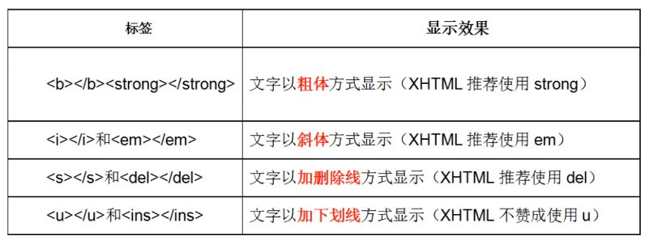
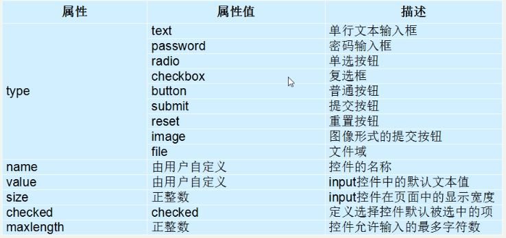

## 零碎知识点
1. `div` -division，分区，分割
   `span`跨度，跨越，范围

2. 文本格式化标签


3. ``

4. anchor`<a href="https://www.baidu.com/" target="_blank">文本或图片</a>`

   - 网页必须加`https:`
   - target: `_self/_blank`

5. 锚点定位

   `<a href="#要定位的class">跳到某一条</a>`

6. `base`标签：单标签，用于统一设置页面的跳转方式，写在head标签里

   `<base target="_blank" />`

7. 特殊字符替换码

   

8. 上一级路径`../`

9. 无序列表`ul`，无序列表`ol`

   ```html
   <ul> ul中只放li标签，li标签中可以放其他标签
       <li>列表项1</li>
       <li>列表项2</li>
       <li>列表项3</li>
   </ul>
   ```

   

10. 自定义列表`dl`

    ```html
    <dl>
        <dt>服务支持</dt>
        <dd><a rel="nofollow" href="service/exchange" target="_blank">售后政策</a></dd>
        <dd><a rel="nofollow" href="service/" target="_blank">自助服务</a></dd>
        <dd><a rel="nofollow" href="service/download/" target="_blank">相关下载</a></dd>
    </dl>
    ```

    

11. 表格`table-tr/caption-td/th`

    1. table的属性

       > border：表格边框，单位px，默认0
       >
       > cellspacing：单元格与单元格的间距，默认2px
       >
       > cellpadding：单元格内容与单元格边框的间距，默认1px
       >
       > align：设置表格在网页中的水平对齐方式，left、center、right

    2. 合并单元格，跨行合并`rowspan`，跨列合并`colspan`

    ```html
    <table width="300" height="200" border="2" cellspacing="0" cellpadding="10" align="center">
        <caption>表格标题</caption>
        <thead> thead和tbody用于区分表头和内容，
        	<tr>
        		<th>th表头姓名</th>
            	<th>性别</th>
            	<th>年龄</th>
        	</tr>
        </thead>
        <tbody>
        	<tr>
                <td>周星星</td>
                <td colspan="2">男49</td>
                年龄被跨列合并了
        	</tr>
            <tr>
                <td>曾轶可</td>
                <td>男</td>
                <td rowspan="2">19</td>
        	</tr>
        	<tr>
                <td>何雯娜</td>
                <td>女</td>
                年龄跨行合并了
        	</tr>
        </tbody>
    </table>
    ```

    

12. `input`属性

    

    > radio和checkbox 通过name是否相同来确定是否是同一组
    >
    > checked="checked" 表示默认被选中

13. **input**的***type***在html5中新增的属性值

    > email 邮箱
    >
    > tel 手机号码
    >
    > url 
    >
    > number 数字
    >
    > search 搜索框（体现语义）
    >
    > range 自由拖动滑块，可拖动的进度条
    >
    > time 小时分钟
    >
    > date 年月日
    >
    > datetime 时间
    >
    > month 年月
    >
    > week  年星期，如2023年第22周
    >
    > color 选择颜色

14. **input**的新属性

    * **placeholder**：`<input type="text" placeholder="请输入用户名"/>`
      * 占位符

    * **autofocus**：`<input type="text" autofocus/>`
      * 页面加载自动获得焦点
    * **multiple**：`<input type="file" multiple />`
      * 可选择多个文件上传
    * **autocomplete**：`<input type="text" autocomplete="on" name="要有name值"/>`
      * 值为on时表示记录曾经输入，下次输入相同内容会有提示
      * 条件：1. 提交过才会有记录；2. input的name属性要有值
    * **required**：`<input type="text" required />`
      * 必填
    * **accesskey**：`<input type="text" accesskey="s" />`
      * 通过`alt + s`使元素获得焦点

15. `label`标签

    ```html
    <label for="pwd"> 默认密码输入框获取焦点
    	账号：<input type="text" />
        密码：<input type="password" id="pwd"/>
    </label>
    ```

16. `textarea`文本域

    ```html
    <textarea cols="每行字符数" rows="显示的行数">文本内容</textarea>
    ```

    

17. `select-option`下拉选择菜单

    ```html
    <select>
        <option>北京</option>
        <option selected="selected">深圳</option> 默认选中深圳
        <option>上海</option>
        <option>广州</option>
    </select>
    ```

    

18. `form`表单域，用于包裹上面的输入标签

    ```html
     <form action="要提交到的目的地链接" method="get/post" name="userMsg"></form>
    ```


17. html5的新标签

    - `<header>`，定义页面的头部，页眉
    - `<nav>`，定义导航栏
    - `<article>`，定义文章
    - `<aside>`，侧边
    - `<section>`，区域
    - `<footer>`，页脚

18. `datalist`标签与`input`连用，实现文本框提示功能

    ```html
    <input type="text" list="star" /> <!--通过指定id-->
    <datalist id="star">
    	<option>刘德华</option>
        <option>刘晓庆</option>
        <option>刘若英</option>
        <option>郭富城</option>
        <option>郭涛</option>
    </datalist>
    ```

19. `fieldset`将表单内的相关元素分组、打包，常与`legend`搭配使用

    ```html
    <fieldset>
        <legend>用户登陆</legend>
        用户名：<input type="text"/> <br />
        密　码：<input type="password"/>
    </fieldset>
    ```

20. **embed**或**iframe**用于引入网络视频
    ```html
    <iframe height=498 width=510 src='http://player.youku.com/embed/XNDIyMTI1Njc0NA==' frameborder=0 'allowfullscreen'></iframe>
    ```
    
21. **audio**标签

    ```html
    <audio src="rain.mp3" autoplay="autoplay" controls loop="2"></audio>
    <!--
    	autoplay：自动播放，="autoplay"可以省略
    	controls：显示默认播放控件
    	loop：循环次数，-1表示无限循环
    -->
    <!--source标签：兼容浏览器-->
    <audio autoplay controls loop="-1">
    	<source src="rain.mp3"/>
    	<source src="rain.ogg"/>
        您的浏览器不支持
    </audio>
    ```

22. **video**属性同audio，多了width和height